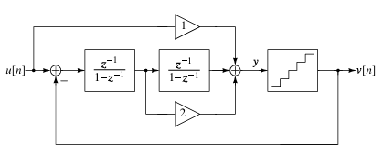
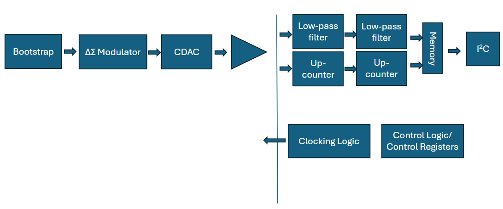
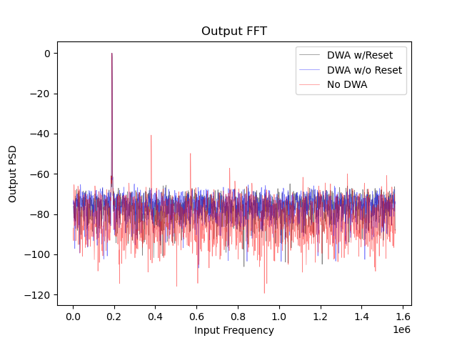

# Noise-Shaping SAR PCB
The goal of this project is to create a 2nd-order, noise shaping SAR on a printed circuit board (PCB). The reasoning is to understand the architecture and the circuit design, since the performance will not come close to an integrated circuit (IC).

## Architecture
This PCB follows the Silva-Steensgard architecture detailed in [1], shown below:

The quantizer is implemented as a 3-bit SAR ADC to reduce quantization noise. This introduces a number of design challenges, the main ones being:
1) The SAR ADC generally requires a dual-tail comparator, so the comparator may have to be made of discrete transistors instead of using a comparator IC.
2) The feedback DAC will must rotated using DEM.

Due to issues with speed and the number of samples for a continuous-mode ADC, the DEM and potential limitations with memory also means adding an option within the architecture for incremental mode. This will reduce the required number of samples for meaningful data, since continuous ADCs require a warmup before the noise shaping becomes visible.

## Controls
By using control registers, it will also be possible to set several things about the ADC:
1) The oversampling rate (OSR), which is only applicable for incremental mode
2) The total number of analysis samples (nfft)
3) Whether the ADC is in incremental or continous mode
4) The clock division ratio (dividing down from a master clock in the FPGA)
5) Turning DEM on and off
6) The number of 'warmup' samples
7) The 2nd-order filter coefficients for continuous mode

The controls and communication will be done via I2C. This means the setting of the control registers, beginning ADC operation, reading control registers, and reading data.

## Design
The digital side of the ADC, including communication and potentially clocking, is implemented on an FPGA. However, this design is meant to imitate a tapeout, so industry standard verification methodology is used, as far as free or open-source tools are available. This will include SystemVerilog real number modeling (SV-RNM) of the analog core. This is also an opportunity to do a deep-dive into Universal Verification Methodology (UVM). Therefore, the design process is as follows:
| Step | Tool |
| :--- | :--- |
| Initial Modeling | Python |
| Digital Logic Design | Xilinx Vivado |
| Analog SV Model | Xilinx Vivado |
| UVM Testbench | Xilinx Vivado |
| Analog Design | LTSpice |
| PCB Design | Altium Designer |
| Analog Verification | LTSpice/Altium |
| PCB Testing | Arduino/Electrical Test Bench |
| Analysis | Python |
| Documentation | Microsoft Office Online |

### Initial Block Diagram
The analog circuitry is on the left, and the digital on the right. The digital logic has all the control logic and the digital filters both for continuous mode and for incremental mode. It also has the storage and communication logic that will communicate directly with the tester, since the terminations are already handled.

### Registers
There are 3 4-bit registers on the device that can be read and written via SPI:
| Register Address | Bit Breakdown | Meaning |
| :--- | :--- | :--- |
| 0x00 | NFFT Power (4-bit unsigned) | Power of 2 corresponding to NFFT, default 12, so number of samples would be 2 ^ 12 |
| 0x01 | 3-bit OSR, 1-bit DWA Enable | Power of 2 corresponding to OSR, default 3, so oversample ratio would be 2 ^ 3, or 8 |
| 0x02 | Sample Clock Divider (4-bit unsigned)  | Sample clock divider, used for testing max conversion speed |

### SPI Interface
There are 4 possible commands via SPI, each consisting of 1 byte from the master to slave, followed by
1 or more half-byte responses. They are as follows.

| Command | Bits [7:6] | Bits[5:4] | Bits[3:0] | Response
| :--- | --- | --- | --- | :--- |
| Write Register | 01 | 2'{reg_index} | Register Value | 4-bit Register Value |
| Read Register | 00 | 2'{reg_index} | N/A | 4-bit Register Value |
| Mem Read | 10 | N/A | N/A | MSB-first memory data in 4-bit packets |
| Begin Sample | 11 | N/A | N/A | 4'1010 |

Each sample of a memory read value will be 4-values, with each data word being 2
unsigned bytes long, or 4 data packets. While chip select is low, the SPI module
will send 2 ^ NFFT 2-byte words with MSB-first, and will not wait for an ACK from the MISO.

CPOL and CPHA are both 0, e.g., SPI mode is 0.

#### Example Register Write
Write register 2 with value 0110, so set sample clock to (global clock frequency / 6)

Packet Data: 8-bit `01_10_0110`
Response: `0110`

#### Example Register Read
Read register 0 data, receiving a 12, meaning ADC will take 2 ^ 12 samples

Packet Data: `00_00_0000`
Response: `1100`

#### Example Memory Read
Read Data Memory, receiving NFFT 16-bit values

Packet Data: `10_00_0000`
Response:
`0110_1001_0101_1001`
`0010_0010_0111_1101`
...
`1010_0001_1111_0010`

## Python Simulation
The Python simulation shows an SNR of over 40 dB. This is discounting mismatch
noise, but DWA is shown to significantly reduce harmonics introduced by
capacitor mismatch, which is significant on discrete components.

This is with a single stage IADC.

## UVM Verification Environment
The 